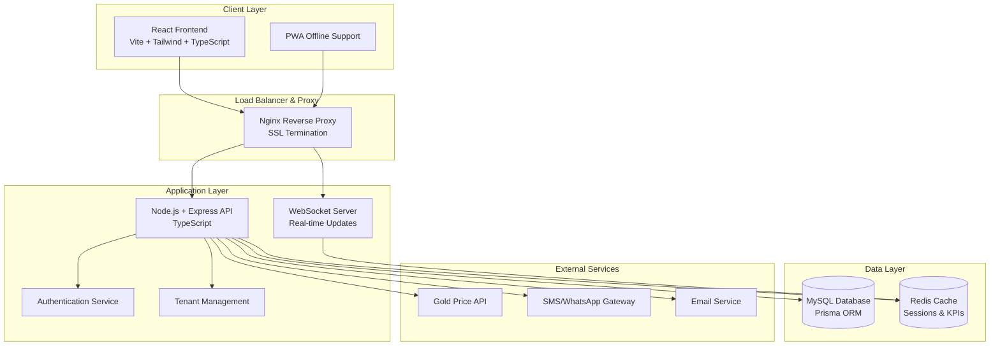
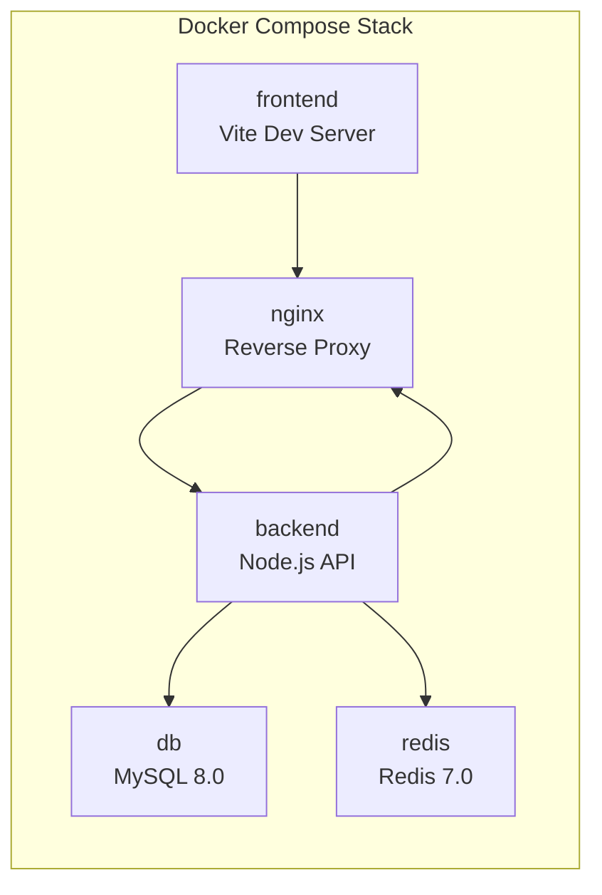

# Design Document

## Overview

The Professional Jeweler SaaS Platform is designed as a multi-tenant, microservices-oriented application with a focus on security, scalability, and Persian language support. The architecture follows modern web development practices with containerized deployment, real-time capabilities, and comprehensive business logic for jewelry-specific operations.

## Architecture

### High-Level Architecture



### Multi-Tenant Architecture

The platform implements tenant isolation through database-level separation:

1. **Tenant Database Strategy**: Each tenant gets a separate MySQL database schema
2. **Tenant Context Middleware**: All API requests include tenant identification
3. **Data Isolation**: Strict enforcement prevents cross-tenant data access
4. **Shared Services**: Authentication, billing, and platform management remain shared

### Container Architecture



## Components and Interfaces

### Frontend Components

#### Core Layout Components
- **RTLLayout**: Main layout wrapper with RTL support
- **Navigation**: Persian navigation with role-based menu items
- **Dashboard**: Drag-and-drop widget system
- **NotificationCenter**: Real-time alerts and system messages

#### Business Logic Components
- **InvoiceManager**: Invoice creation, editing, and PDF generation
- **CustomerCRM**: Customer profiles, ledgers, and communication
- **InventoryTracker**: Product management with barcode support
- **AccountingModule**: Double-entry bookkeeping interface
- **ReportsEngine**: Financial and business reports

#### Shared Components
- **PersianDatePicker**: Jalali calendar support
- **NumberFormatter**: Persian/English digit conversion
- **BarcodeScanner**: Camera-based barcode reading
- **FileUploader**: Document and image upload handling

### Backend API Structure

#### Authentication & Authorization
```typescript
interface AuthService {
  login(credentials: LoginCredentials): Promise<AuthResult>
  validateToken(token: string): Promise<UserContext>
  refreshToken(refreshToken: string): Promise<TokenPair>
  logout(token: string): Promise<void>
  enable2FA(userId: string): Promise<TwoFactorSetup>
}

interface TenantMiddleware {
  extractTenant(request: Request): Promise<TenantContext>
  validateTenantAccess(user: User, tenant: string): Promise<boolean>
  switchTenantContext(tenantId: string): Promise<void>
}
```

#### Core Business Services
```typescript
interface InvoiceService {
  createInvoice(data: InvoiceData): Promise<Invoice>
  calculateGoldPrice(weight: number, goldPrice: number, fees: GoldFees): number
  generatePDF(invoiceId: string): Promise<Buffer>
  processPayment(invoiceId: string, payments: Payment[]): Promise<PaymentResult>
  scheduleRecurring(invoiceId: string, schedule: RecurringSchedule): Promise<void>
}

interface InventoryService {
  addProduct(product: ProductData): Promise<Product>
  updateStock(productId: string, quantity: number, reason: string): Promise<StockMovement>
  generateBarcode(productId: string): Promise<string>
  checkMinimumLevels(): Promise<LowStockAlert[]>
  calculateBOM(bomId: string, quantity: number): Promise<BOMCalculation>
}

interface CustomerService {
  createCustomer(data: CustomerData): Promise<Customer>
  updateLedger(customerId: string, transaction: LedgerEntry): Promise<void>
  getBalance(customerId: string): Promise<CustomerBalance>
  sendReminder(customerId: string, type: ReminderType): Promise<void>
  checkCreditLimit(customerId: string, amount: number): Promise<CreditCheckResult>
}

interface AccountingService {
  createJournalEntry(entry: JournalEntryData): Promise<JournalEntry>
  processDoubleEntry(debit: AccountEntry, credit: AccountEntry): Promise<void>
  generateTrialBalance(date: Date): Promise<TrialBalance>
  reconcileBank(bankData: BankStatement[]): Promise<ReconciliationResult>
  lockPeriod(fromDate: Date, toDate: Date): Promise<void>
}
```

### Database Schema Design

#### Tenant Management
```sql
-- Platform-level tables (shared)
CREATE TABLE tenants (
    id VARCHAR(36) PRIMARY KEY,
    name VARCHAR(255) NOT NULL,
    subdomain VARCHAR(100) UNIQUE,
    database_name VARCHAR(100) NOT NULL,
    status ENUM('active', 'suspended', 'trial') DEFAULT 'trial',
    created_at TIMESTAMP DEFAULT CURRENT_TIMESTAMP
);

CREATE TABLE tenant_users (
    id VARCHAR(36) PRIMARY KEY,
    tenant_id VARCHAR(36) NOT NULL,
    email VARCHAR(255) NOT NULL,
    password_hash VARCHAR(255) NOT NULL,
    role ENUM('super_admin', 'tenant_admin', 'employee') NOT NULL,
    two_factor_enabled BOOLEAN DEFAULT FALSE,
    FOREIGN KEY (tenant_id) REFERENCES tenants(id)
);
```

#### Business Data Schema (Per Tenant)
```sql
-- Customer Management
CREATE TABLE customers (
    id VARCHAR(36) PRIMARY KEY,
    name VARCHAR(255) NOT NULL,
    phone VARCHAR(20),
    email VARCHAR(255),
    address TEXT,
    tax_id VARCHAR(50),
    credit_limit DECIMAL(15,2) DEFAULT 0,
    customer_group VARCHAR(100),
    created_at TIMESTAMP DEFAULT CURRENT_TIMESTAMP
);

-- Product Inventory
CREATE TABLE products (
    id VARCHAR(36) PRIMARY KEY,
    name VARCHAR(255) NOT NULL,
    category ENUM('raw_gold', 'finished_jewelry', 'coins', 'stones'),
    barcode VARCHAR(100) UNIQUE,
    weight DECIMAL(10,4),
    purity DECIMAL(5,2),
    current_stock INT DEFAULT 0,
    minimum_stock INT DEFAULT 0,
    unit_price DECIMAL(15,2)
);

-- Invoice System
CREATE TABLE invoices (
    id VARCHAR(36) PRIMARY KEY,
    invoice_number VARCHAR(50) UNIQUE NOT NULL,
    customer_id VARCHAR(36),
    type ENUM('sale', 'purchase', 'trade') NOT NULL,
    subtotal DECIMAL(15,2) NOT NULL,
    tax_amount DECIMAL(15,2) DEFAULT 0,
    total_amount DECIMAL(15,2) NOT NULL,
    status ENUM('draft', 'sent', 'paid', 'cancelled') DEFAULT 'draft',
    created_at TIMESTAMP DEFAULT CURRENT_TIMESTAMP,
    FOREIGN KEY (customer_id) REFERENCES customers(id)
);

-- Accounting System
CREATE TABLE chart_of_accounts (
    id VARCHAR(36) PRIMARY KEY,
    account_code VARCHAR(20) UNIQUE NOT NULL,
    account_name VARCHAR(255) NOT NULL,
    account_type ENUM('asset', 'liability', 'equity', 'revenue', 'expense'),
    parent_account_id VARCHAR(36),
    is_active BOOLEAN DEFAULT TRUE
);

CREATE TABLE journal_entries (
    id VARCHAR(36) PRIMARY KEY,
    entry_number VARCHAR(50) UNIQUE NOT NULL,
    description TEXT,
    entry_date DATE NOT NULL,
    reference_type VARCHAR(50),
    reference_id VARCHAR(36),
    total_debit DECIMAL(15,2) NOT NULL,
    total_credit DECIMAL(15,2) NOT NULL,
    status ENUM('draft', 'posted', 'locked') DEFAULT 'draft'
);
```

## Data Models

### Core Business Models

#### Invoice Model
```typescript
interface Invoice {
  id: string
  invoiceNumber: string
  customerId: string
  type: 'sale' | 'purchase' | 'trade'
  items: InvoiceItem[]
  payments: Payment[]
  subtotal: number
  taxAmount: number
  totalAmount: number
  goldPrice: number
  manufacturingFee: number
  profitMargin: number
  status: InvoiceStatus
  notes?: string
  attachments?: string[]
  isRecurring: boolean
  recurringSchedule?: RecurringSchedule
  createdAt: Date
  updatedAt: Date
}

interface InvoiceItem {
  productId: string
  quantity: number
  weight?: number
  unitPrice: number
  goldPrice?: number
  manufacturingFee?: number
  lineTotal: number
}
```

#### Customer Model
```typescript
interface Customer {
  id: string
  name: string
  phone?: string
  email?: string
  address?: string
  taxId?: string
  creditLimit: number
  currentBalance: number
  customerGroup?: string
  tags: string[]
  ledgerEntries: LedgerEntry[]
  birthDate?: Date
  anniversaryDate?: Date
  communicationPreferences: CommunicationPrefs
  createdAt: Date
  updatedAt: Date
}

interface LedgerEntry {
  id: string
  customerId: string
  type: 'debit' | 'credit'
  amount: number
  currency: string
  description: string
  referenceType: string
  referenceId: string
  balance: number
  entryDate: Date
}
```

#### Product Model
```typescript
interface Product {
  id: string
  name: string
  category: ProductCategory
  barcode?: string
  weight?: number
  purity?: number
  currentStock: number
  minimumStock: number
  unitPrice: number
  bomComponents?: BOMComponent[]
  supplier?: string
  location?: string
  lastStockMovement?: Date
  createdAt: Date
  updatedAt: Date
}

interface BOMComponent {
  componentId: string
  quantity: number
  wastagePercentage: number
}
```

### Accounting Models

```typescript
interface JournalEntry {
  id: string
  entryNumber: string
  description: string
  entryDate: Date
  referenceType?: string
  referenceId?: string
  lineItems: JournalLineItem[]
  totalDebit: number
  totalCredit: number
  status: 'draft' | 'posted' | 'locked'
  costCenter?: string
  createdBy: string
  createdAt: Date
}

interface JournalLineItem {
  accountId: string
  debitAmount: number
  creditAmount: number
  description: string
  costCenter?: string
}

interface Account {
  id: string
  accountCode: string
  accountName: string
  accountType: AccountType
  parentAccountId?: string
  currentBalance: number
  isActive: boolean
  currency: string
}
```

## Error Handling

### API Error Response Structure
```typescript
interface APIError {
  code: string
  message: string
  details?: any
  timestamp: Date
  requestId: string
  tenantId?: string
}

enum ErrorCodes {
  VALIDATION_ERROR = 'VALIDATION_ERROR',
  AUTHENTICATION_FAILED = 'AUTH_FAILED',
  AUTHORIZATION_DENIED = 'AUTH_DENIED',
  TENANT_NOT_FOUND = 'TENANT_NOT_FOUND',
  RESOURCE_NOT_FOUND = 'RESOURCE_NOT_FOUND',
  BUSINESS_RULE_VIOLATION = 'BUSINESS_RULE_VIOLATION',
  EXTERNAL_SERVICE_ERROR = 'EXTERNAL_SERVICE_ERROR',
  DATABASE_ERROR = 'DATABASE_ERROR',
  RATE_LIMIT_EXCEEDED = 'RATE_LIMIT_EXCEEDED'
}
```

### Error Handling Strategy
1. **Input Validation**: Joi/Zod schemas for request validation
2. **Business Logic Errors**: Custom error classes with specific codes
3. **Database Errors**: Prisma error handling with retry logic
4. **External Service Errors**: Circuit breaker pattern for API calls
5. **Logging**: Structured logging with correlation IDs
6. **User-Friendly Messages**: Persian error messages for frontend

### Global Error Middleware
```typescript
const errorHandler = (error: Error, req: Request, res: Response, next: NextFunction) => {
  const errorResponse: APIError = {
    code: getErrorCode(error),
    message: getLocalizedMessage(error, req.headers['accept-language']),
    timestamp: new Date(),
    requestId: req.headers['x-request-id'] as string,
    tenantId: req.tenantContext?.id
  }
  
  logger.error('API Error', { error: errorResponse, stack: error.stack })
  res.status(getStatusCode(error)).json(errorResponse)
}
```

## Testing Strategy

### Testing Pyramid

#### Unit Tests (70%)
- **Business Logic**: Invoice calculations, accounting rules, inventory management
- **Utilities**: Date formatting, number conversion, validation functions
- **Services**: Individual service methods with mocked dependencies
- **Models**: Data model validation and transformation

#### Integration Tests (20%)
- **Database Integration**: Real MySQL database connections and operations
- **Redis Integration**: Caching and session management with real Redis
- **API Endpoints**: Full request/response cycle testing
- **External Services**: Gold price API, SMS/Email service integration

#### End-to-End Tests (10%)
- **User Workflows**: Complete business processes from UI to database
- **Multi-tenant Scenarios**: Cross-tenant isolation verification
- **Real-time Features**: WebSocket functionality testing
- **Performance Tests**: Load testing with realistic data volumes

### Testing Infrastructure

#### Database Testing Setup
```typescript
// Test database configuration
const testConfig = {
  mysql: {
    host: 'localhost',
    port: 3306,
    database: 'jeweler_test',
    username: 'test_user',
    password: 'test_password'
  },
  redis: {
    host: 'localhost',
    port: 6379,
    db: 1 // Separate test database
  }
}

// Test data seeding
beforeEach(async () => {
  await seedTestDatabase()
  await clearRedisCache()
})
```

#### Docker Test Environment
```yaml
# docker-compose.test.yml
version: '3.8'
services:
  test-db:
    image: mysql:8.0
    environment:
      MYSQL_ROOT_PASSWORD: test_root
      MYSQL_DATABASE: jeweler_test
    ports:
      - "3307:3306"
  
  test-redis:
    image: redis:7.0
    ports:
      - "6380:6379"
```

### Continuous Testing Strategy
1. **Pre-commit Hooks**: Run unit tests and linting
2. **Pull Request Pipeline**: Full test suite execution
3. **Staging Deployment**: Integration and E2E tests
4. **Production Monitoring**: Health checks and performance metrics

### Test Data Management
- **Fixtures**: Predefined test data for consistent testing
- **Factories**: Dynamic test data generation
- **Cleanup**: Automatic test data cleanup after each test
- **Isolation**: Each test runs with fresh database state